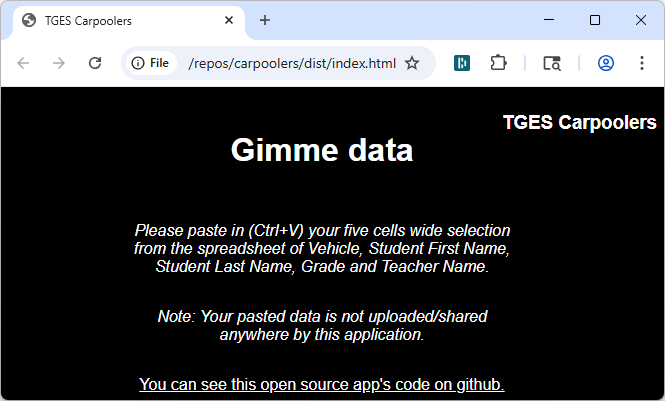
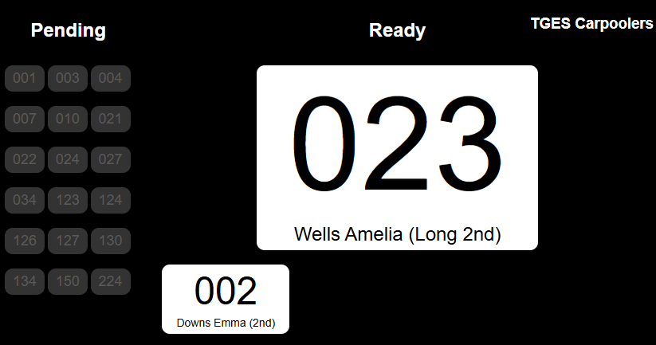

# Mrs. Hillis' Carpoolers

A school carpool pickup announcement display helper application.

# Build from this source

1. `git clone` this repo locally, and from the project folder in the command line:
2. `npm install` to install the various dependencies
3. `npm run build` to build to the `./dist` folder
4. Open the resulting `index.html` from the dist folder with your browser to see 

5. Copy the range of data from excel (or suitable intermediate plaintext file) with the prescribed columns.  This needs to be done exactly or your data will not be imported correctly.

6. Type any terms from the data separated by spaces to filter the pending list.  Press [escape] key to clear.  Narrow to exactly one match so that you can hit [enter] to highlight that data, even if that item has already been found previously.  Or use the mouse to toggle between Pending and Ready states.

Note: This web app intentionally does NOT remember your data between refreshes/closing your browser and does not upload your data anywhere.  All processing is done locally and there are no remote servers or logins involved.